# **Projeto Freelance Instrutor Físico**


Com a nossa aplicação, os usuários teram acesso a um instrutor de ginástica altamente capacitado, pronto para lhe fornecer planos de treino personalizados e acompanhamento constante para garantir que você alcance seus objetivos de forma segura e eficaz.

# **Desenvolvimento**

## index.html

Este é o código fonte de um site em HTML. O site se apresenta como pertencente a Sergio Valentino, um personal trainer e instrutor de ginástica. Ele apresenta seções como "Início", "Sobre", "Serviços" e "Contato". O site possui uma barra de navegação com links para cada seção, bem como um logotipo e um menu de opções. A seção "Sobre" inclui uma galeria de imagens e um texto descrevendo o trabalho de Sergio Valentino. A seção "Contato" provavelmente permitirá que os usuários entrem em contato com Sergio Valentino para contratar seus serviços.. O código HTML inclui links para arquivos CSS externos e um script para um ícone de fontes.

```html
<!DOCTYPE html>
<html lang="en">
  <head>
    <meta charset="UTF-8" />
    <meta http-equiv="X-UA-Compatible" content="IE=edge" />
    <meta name="viewport" content="width=device-width, initial-scale=1.0" />
    <title>Seja FITNESS</title>
    <link rel="shortcut icon" href="src/img/icon-2.png" type="image/x-icon" />

    <link rel="stylesheet" href="./src/css/styles.css" />
    <link rel="stylesheet" href="./src/css/gallery.theme.css" />
    <link rel="stylesheet" href="./src/css/gallery.min.css" />
    <script src="https://kit.fontawesome.com/53814c37e1.js" crossorigin="anonymous"></script>
  </head>
  <body>
    <div class="scroll-up-btn">
      <ion-icon name="chevron-up-outline"></ion-icon>
    </div>
    <div class="navbar">
      <div class="max-width">
        <div class="logo">
          <a href="#teams">Seja<span> FITNESS</span></a>
        </div>
        <ul class="menu">
          <li><a href="#home">Inicio</a></li>
          <li><a href="#about">Sobre</a></li>
          <li><a href="#services">Serviços</a></li>
          <li><a href="#contact">Contato</a></li>
        </ul>
        <div class="menu-btn">
          <ion-icon name="menu-outline"></ion-icon>
        </div>
      </div>
    </div>

    <!--home inicio-->
    <section class="home" id="home">
      <div class="max-width">
        <div class="home-content">
          <div class="text-1">Ola, meu nome é</div>
          <div class="text-2">Sergio Valentino</div>
          <div class="text-3">eu sou <span class="typing"></span></div>
          <a href="#contact">Contrate - me</a>
        </div>
      </div>
    </section>

    <!--sessão sobre-->
    <section class="about" id="about">
      <div class="max-width">
        <h2 class="title">Quem sou Eu</h2>
        <div class="about-content">
          <div class="column left">
            <div class="gallery autoplay items-5">
              <div id="item-1" class="control-operator"></div>
              <div id="item-2" class="control-operator"></div>
              <div id="item-3" class="control-operator"></div>
              <div id="item-4" class="control-operator"></div>
              <div id="item-5" class="control-operator"></div>
              <div id="item-6" class="control-operator"></div>
              <div id="item-7" class="control-operator"></div>

              <figure class="item">
                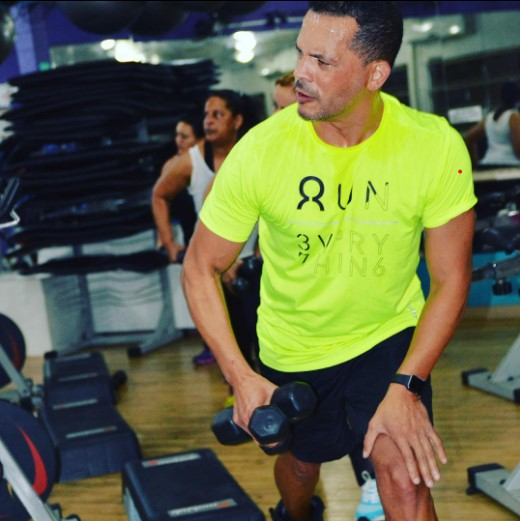
              </figure>

              <figure class="item">
                <h1>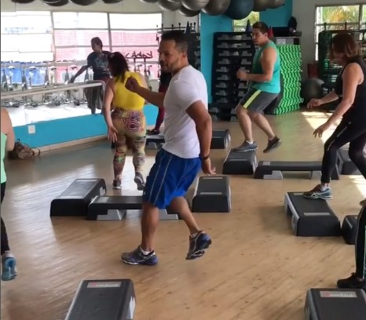</h1>
              </figure>

              <figure class="item">
                <h1>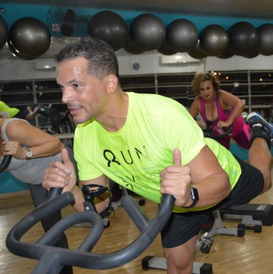</h1>
              </figure>

              <figure class="item">
                <h1>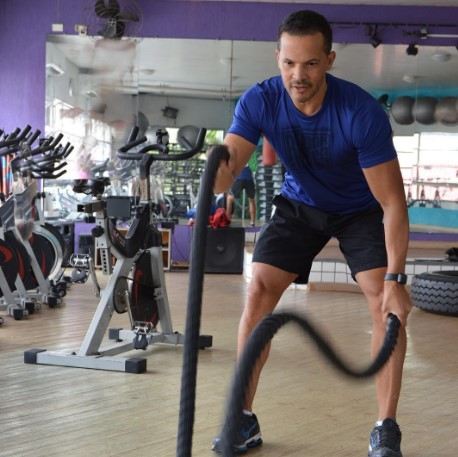</h1>
              </figure>

              <figure class="item">
                <h1>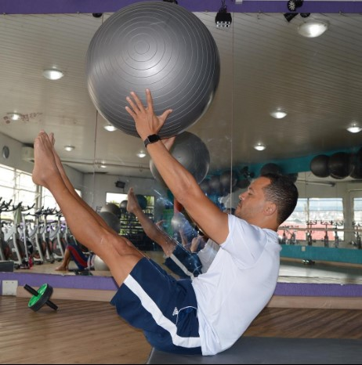</h1>
              </figure>

              <figure class="item">
                <h1>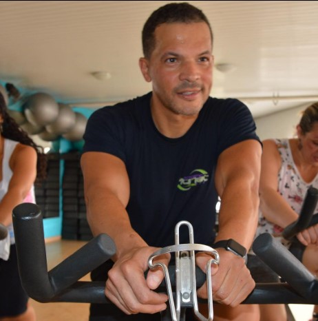</h1>
              </figure>

              <figure class="item">
                <h1>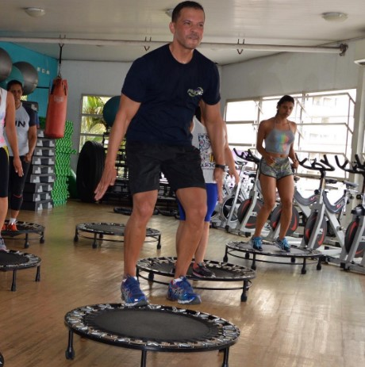</h1>
              </figure>
            </div>
          </div>
          <div class="column right">
            <div class="text">
              Sou Sergio Valentino <span class="typing-2"></span>
            </div>
            <br />
            <p>
              Venho trabalhando como Personal trainer e instrutor de ginástica a muitos anos,
              mantendo o registro da evolução de todos os meus clientes com sólidos resultados, possuo experiência em Fitness.
              Sou instrutor das seguintes aulas: Step, Bike, Jump, Funcional, Ginástica localizada, Alongamento, Pilates e Prevenção de Obsidade.
            </p>
            <br />
            <br />
            <br />
            <br />
            <br />
            <a href="#contact" class="contato">Contrate - me</a>
            <br />
            <br />
            <br />
            <br />
           <div class="sm">
           
            <a href="" target="_blank">
              <i class="about_icon fa-brands fa-linkedin fa-3x "></i>
            </a>

            <a href="https://www.instagram.com/sergiovallentino/" target="_blank">
              <i class="about_icon fa-brands fa-instagram fa-3x "></i>
            </a>
      
            <a href="" target="_blank">
              <i class="about_icon fa-brands fa-facebook fa-3x"></i>
            </a>
      
            <a href="" target="_blank">
              <i class="about_icon fa-brands fa-telegram  fa-3x"></i>
            </a>
           </div>
            
            
          </div>
        </div>
      </div>
    </section>

    <!-- Sessão serviços-->
    <section class="services" id="services">
      <h1>Meus serviços</h1>
      <div class="container">
        <div class="box">
          
          <div class="info">
            <h3>Jump</h3>
          </div>
        </div>
        <div class="box">
          
          <div class="info">
            <h3>Pilates</h3>
          </div>
        </div>
        <div class="box">
          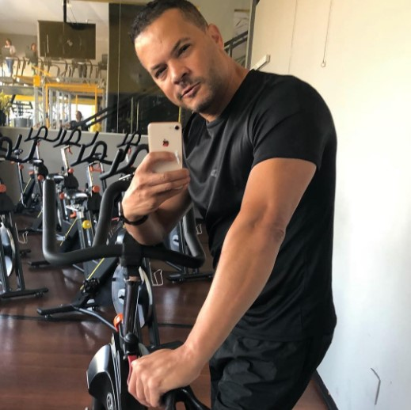
          <div class="info">
            <h3>Bike</h3>
          </div>
        </div>
        <div class="box">
          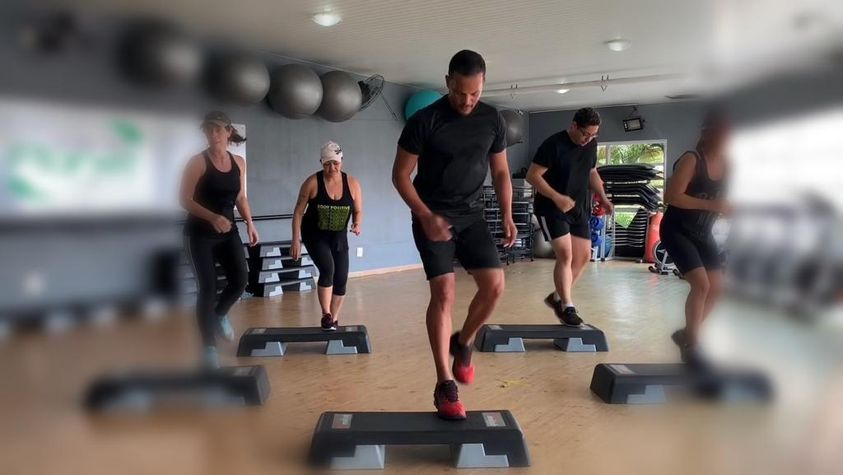
          <div class="info">
            <h3>Step</h3>
          </div>
        </div>
        <div class="box">
          
          <div class="info">
            <h3>Funcional</h3>
          </div>
        </div>

        <div class="box">
          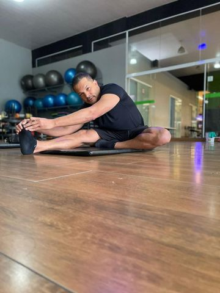
          <div class="info">
            <h3>Alongamento</h3>
          </div>
        </div>
        <div class="box">
          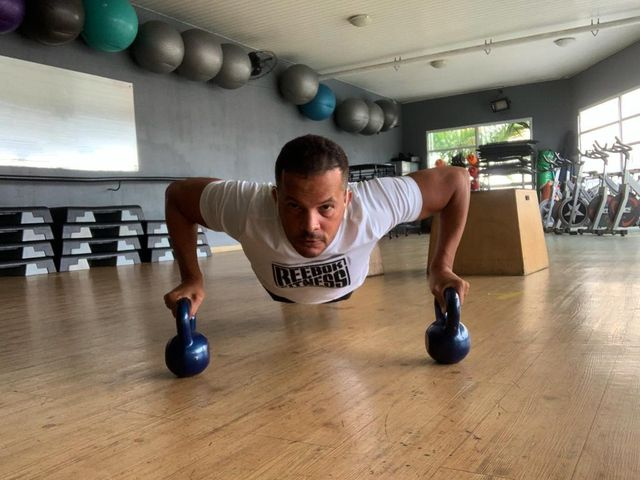
          <div class="info">
            <h3>A.B.S</h3>
          </div>
        </div>
      </div>
    </section>

    <!-- sessão venha ser meu aluno-->
    <section class="banner">
      <h3>VEM TREINAR COMIGO !</h3>
    </section>

    <!--Sessão contato-->
    <section class="contact" id="contact">
      <div class="max-width">
        <h2 class="title">Contato</h2>
        <div class="contact-content">
          <div class="column left">
            <div class="text">Fale Conosco</div>
            <div class="icons">
              <div class="row">
                <ion-icon name="person-outline"></ion-icon>
                <div class="info">
                  <div class="head">Sergio Valentino</div>
                  <div class="sub-title"></div>
                </div>
              </div>
              
              <div class="row">
                <ion-icon name="person-outline"></ion-icon>
                <div class="info">
                  <div class="head">(11) 9.5540-2001</div>
                  <div class="sub-title"></div>
                </div>
              </div>
              <div class="row">
                <ion-icon name="person-outline"></ion-icon>
                <div class="info">
                  <div class="head">sergio_vallentino@hotmail.com</div>
                  <div class="sub-title"></div>
                </div>
              </div>
              <div class="row">
                <ion-icon name="earth-outline"></ion-icon>
                <div class="info">
                  <div class="head">São Paulo - SP</div>
                  <div class="sub-title"></div>
                </div>
              </div>
            </div>
             <!--Sessão Redes sociais-->
            <div class="flex">
              
        
              <a href="" target="_blank">
                <i class="fa-brands fa-linkedin fa-3x icon-3d"></i>
              </a>
              <a href="https://www.instagram.com/sergiovallentino/" target="_blank">
                <i class="fa-brands fa-instagram fa-3x icon-3d"></i>
              </a>
        
              <a href="" target="_blank">
                <i class="fa-brands fa-facebook fa-3x icon-3d"></i>
              </a>
        
              <a href="" target="_blank">
                <i class="fa-brands fa-telegram  fa-3x icon-3d"></i>
              </a>
            </div>
          </div>
          <!--column left-->
          <div class="column rigth">
            <div class="text">Mensagem</div>
            <form
              action="https://formsubmit.co/sergio_vallentino@hotmail.com"
              method="POST"
            >
              <div class="fields">
                <div class="field name">
                  <input
                    type="text"
                    name="Nome"
                    placeholder="Nome"
                    id="nome"
                    required
                  />
                </div>
                <div class="field email">
                  <input
                    type="email"
                    name="Email"
                    placeholder="Email"
                    id="email"
                    required
                  />
                </div>
              </div>
              <div class="field">
                <div class="field">
                  <input
                    type="text"
                    name="Sobrenome"
                    placeholder="Sobrenome"
                    id="sobrenome"
                    required
                  />
                </div>
                <div class="field textarea">
                  <textarea
                    cols="30"
                    rows="10"
                    name="Mensagem"
                    placeholder="Mensagem"
                    id="escrever...."
                    required
                  ></textarea>
                </div>
                <div class="button">
                  <input
                    type="hidden"
                    name="_next"
                    value="https://edvaldoljr.github.io/Projeto-Site-Persol-Trainer/#home"
                  />
                  <button type="submit">Enviar</button>
                </div>
              </div>
            </form>
          </div>
        </div>
      </div>
    </section>      
    
    <!--sessão  footer-->
    <footer>
      <span
        >Criado por
        <a href="https://github.com/edvaldoljr" target="_blank">Edvaldo.dev</a> |
        Todos os direitos reservado 2022</span
      >
    </footer>

    <script
      type="module"
      src="https://unpkg.com/ionicons@5.5.2/dist/ionicons/ionicons.esm.js"
    ></script>
    <script
      nomodule
      src="https://unpkg.com/ionicons@5.5.2/dist/ionicons/ionicons.js"
    ></script>
    <script src="https://code.jquery.com/jquery-3.6.0.min.js"></script>
    <script src="./src/js/script.js"></script>
    <script src="https://cdnjs.cloudflare.com/ajax/libs/waypoints/4.0.1/jquery.waypoints.min.js"></script>
    <script src="https://cdnjs.cloudflare.com/ajax/libs/OwlCarousel2/2.3.4/owl.carousel.min.js"></script>
    <script src="https://cdnjs.cloudflare.com/ajax/libs/typed.js/2.0.12/typed.min.js"></script>
    <link
      rel="stylesheet"
      href="https://cdnjs.cloudflare.com/ajax/libs/OwlCarousel2/2.3.4/assets/owl.carousel.min.css"
    />
  </body>
</html>

```

## gallery.min.css

Esse código serve para estilos CSS para um componente de galeria/apresentação de slides. Os estilos definem os estilos para os controles (botões anteriores/próximos, etc.), itens (slides) e animações (opacidade e alterações de cor) com base no número de itens (2, 3 ou 4). Os estilos usam seletores CSS para direcionar elementos específicos e quadros-chave de animação para especificar as animações a serem aplicadas a esses elementos. Os estilos também definem diferentes atrasos de animação para os diferentes itens na apresentação de slides.

```css
.gallery .control-operator:target~.controls .control-button{color:#ccc;color:rgba(255,255,255,.4)}.gallery .control-button:first-of-type,.gallery .control-operator:nth-of-type(1):target~.controls .control-button:nth-of-type(1),.gallery .control-operator:nth-of-type(2):target~.controls .control-button:nth-of-type(2),.gallery .control-operator:nth-of-type(3):target~.controls .control-button:nth-of-type(3),.gallery .control-operator:nth-of-type(4):target~.controls .control-button:nth-of-type(4),.gallery .control-operator:nth-of-type(5):target~.controls .control-button:nth-of-type(5){color:#fff;color:rgba(255,255,255,.8)}.gallery .item:first-of-type{position:static;pointer-events:auto;opacity:1}.gallery .item{position:absolute;top:0;left:0;width:100%;height:100%;pointer-events:none;opacity:0;transition:opacity .5s}.gallery .control-operator{display:none}.gallery .control-operator:target~.item{pointer-events:none;opacity:0;animation:none}.gallery .control-operator:target~.controls .control-button{animation:none}@keyframes controlAnimation-2{0%{color:#ccc;color:rgba(255,255,255,.4)}14.3%,50%{color:#fff;color:rgba(255,255,255,.8)}64.3%,100%{color:#ccc;color:rgba(255,255,255,.4)}}@keyframes galleryAnimation-2{0%{opacity:0}14.3%,50%{opacity:1}64.3%,100%{opacity:0}}.gallery .control-operator:nth-of-type(1):target~.item:nth-of-type(1){pointer-events:auto;opacity:1}.gallery .control-operator:nth-of-type(2):target~.item:nth-of-type(2){pointer-events:auto;opacity:1}.items-2.autoplay .control-button{animation:controlAnimation-2 14s infinite}.items-2.autoplay .item{animation:galleryAnimation-2 14s infinite}.items-2 .control-button:nth-of-type(1),.items-2 .item:nth-of-type(1){animation-delay:-2s}.items-2 .control-button:nth-of-type(2),.items-2 .item:nth-of-type(2){animation-delay:5s}@keyframes controlAnimation-3{0%{color:#ccc;color:rgba(255,255,255,.4)}9.5%,33.3%{color:#fff;color:rgba(255,255,255,.8)}42.9%,100%{color:#ccc;color:rgba(255,255,255,.4)}}@keyframes galleryAnimation-3{0%{opacity:0}9.5%,33.3%{opacity:1}42.9%,100%{opacity:0}}.gallery .control-operator:nth-of-type(1):target~.item:nth-of-type(1){pointer-events:auto;opacity:1}.gallery .control-operator:nth-of-type(2):target~.item:nth-of-type(2){pointer-events:auto;opacity:1}.gallery .control-operator:nth-of-type(3):target~.item:nth-of-type(3){pointer-events:auto;opacity:1}.items-3.autoplay .control-button{animation:controlAnimation-3 21s infinite}.items-3.autoplay .item{animation:galleryAnimation-3 21s infinite}.items-3 .control-button:nth-of-type(1),.items-3 .item:nth-of-type(1){animation-delay:-2s}.items-3 .control-button:nth-of-type(2),.items-3 .item:nth-of-type(2){animation-delay:5s}.items-3 .control-button:nth-of-type(3),.items-3 .item:nth-of-type(3){animation-delay:12s}@keyframes controlAnimation-4{0%{color:#ccc;color:rgba(255,255,255,.4)}7.1%,25%{color:#fff;color:rgba(255,255,255,.8)}32.1%,100%{color:#ccc;color:rgba(255,255,255,.4)}}@keyframes galleryAnimation-4{0%{opacity:0}7.1%,25%{opacity:1}32.1%,100%{opacity:0}}.gallery .control-operator:nth-of-type(1):target~.item:nth-of-type(1){pointer-events:auto;opacity:1}.gallery .control-operator:nth-of-type(2):target~.item:nth-of-type(2){pointer-events:auto;opacity:1}.gallery .control-operator:nth-of-type(3):target~.item:nth-of-type(3){pointer-events:auto;opacity:1}.gallery .control-operator:nth-of-type(4):target~.item:nth-of-type(4){pointer-events:auto;opacity:1}.items-4.autoplay .control-button{animation:controlAnimation-4 28s infinite}.items-4.autoplay .item{animation:galleryAnimation-4 28s infinite}.items-4 .control-button:nth-of-type(1),.items-4 .item:nth-of-type(1){animation-delay:-2s}.items-4 .control-button:nth-of-type(2),.items-4 .item:nth-of-type(2){animation-delay:5s}.items-4 .control-button:nth-of-type(3),.items-4 .item:nth-of-type(3){animation-delay:12s}.items-4 .control-button:nth-of-type(4),.items-4 .item:nth-of-type(4){animation-delay:19s}@keyframes controlAnimation-5{0%{color:#ccc;color:rgba(255,255,255,.4)}5.7%,20%{color:#fff;color:rgba(255,255,255,.8)}25.7%,100%{color:#ccc;color:rgba(255,255,255,.4)}}@keyframes galleryAnimation-5{0%{opacity:0}5.7%,20%{opacity:1}25.7%,100%{opacity:0}}.gallery .control-operator:nth-of-type(1):target~.item:nth-of-type(1){pointer-events:auto;opacity:1}.gallery .control-operator:nth-of-type(2):target~.item:nth-of-type(2){pointer-events:auto;opacity:1}.gallery .control-operator:nth-of-type(3):target~.item:nth-of-type(3){pointer-events:auto;opacity:1}.gallery .control-operator:nth-of-type(4):target~.item:nth-of-type(4){pointer-events:auto;opacity:1}.gallery .control-operator:nth-of-type(5):target~.item:nth-of-type(5){pointer-events:auto;opacity:1}.items-5.autoplay .control-button{animation:controlAnimation-5 35s infinite}.items-5.autoplay .item{animation:galleryAnimation-5 35s infinite}.items-5 .control-button:nth-of-type(1),.items-5 .item:nth-of-type(1){animation-delay:-2s}.items-5 .control-button:nth-of-type(2),.items-5 .item:nth-of-type(2){animation-delay:5s}.items-5 .control-button:nth-of-type(3),.items-5 .item:nth-of-type(3){animation-delay:12s}.items-5 .control-button:nth-of-type(4),.items-5 .item:nth-of-type(4){animation-delay:19s}.items-5 .control-button:nth-of-type(5),.items-5 .item:nth-of-type(5){animation-delay:26s}
```

## gallery.theme.css

Este código CSS define estilos para um componente de galeria/apresentação de slides. Os estilos definem as cores dos botões de controle (anteriores/próximos), sua opacidade e mudanças de cor ao passar o mouse sobre eles. Além disso, ele define estilos para itens (slides) como altura, posição, alinhamento do texto e cor de fundo. Os estilos também posicionam os controles na parte inferior da tela e definem sua largura e alinhamento. Por fim, os estilos definem o comportamento da transição de cor para os botões de controle.

```css
.gallery .control-button {
    color: #ccc;
    color: rgba(255, 255, 255, 0.4);
  }
  
  .gallery .control-button:hover {
    color: white;
    color: rgba(255, 255, 255, 0.8);
  }
  
  /*
      Theme controls how everything looks in Gallery CSS.
  */
  .gallery {
    position: relative;
  }
  .gallery .item {
    height: 400px;
    overflow: hidden;
    text-align: center;
    background: #4d87e2;
  }
  .gallery .controls {
    position: absolute;
    bottom: 0;
    width: 100%;
    text-align: center;
  }
  .gallery .control-button {
    display: inline-block;
    margin: 0 .02em;
    font-size: 3em;
    text-align: center;
    text-decoration: none;
    transition: color .1s;
  }
```

## style.css

Este código é para a folha de estilo CSS de um site. Os estilos definem o layout e a aparência de vários elementos no site, incluindo o cabeçalho (barra de navegação), a seção inicial e um botão de menu para dispositivos móveis. Os estilos definem a fonte, o plano de fundo, a cor do texto e outros detalhes de estilo para cada elemento. O código usa CSS para definir os estilos, incluindo estilo para efeitos de foco, capacidade de resposta e transições.

```css
@import url("https://fonts.googleapis.com/css2?family=Roboto:wght@300;400;500&family=Ubuntu:wght@400;500;700&display=swap");
* {
  margin: 0;
  padding: 0;
  box-sizing: border-box;
  text-decoration: none;
}

html {
  scroll-behavior: smooth;
}
.max-width {
  max-width: 1300px;
  padding: 0 80px;
  margin: auto;
}

/*  navbar   inicio*/
.navbar {
  position: fixed;
  width: 100%;
  padding: 30px 0;
  font-family: "Ubuntu", sans-serif;
  z-index: 999;
  transition: all 0.3s ease;
}
.navbar.sticky {
  background: #0c0c0c;
  padding: 15px 0;
}
.navbar .max-width {
  display: flex;
  align-items: center;
  justify-content: space-between;
}
.navbar .logo a {
  color: #fff;
  font-size: 35px;
  font-weight: 500;
}
.navbar .logo a span {
  color: #71d96a;
  transition: all 0.3s ease;
}
.navbar.sticky .logo a span {
  color: #fff;
}
.navbar .menu li {
  list-style: none;
  display: inline-block;
}
.navbar .menu li a {
  color: #fff;
  font-size: 18px;
  font-weight: 500;
  margin-left: 25px;
  transition: color 0.3s ease;
}
.navbar .menu li a:hover {
  color: #71d96a;
}
.navbar.sticky .menu li a:hover {
  color: #fff;
}
/*  Home   inicio  */
.home {
  display: flex;
  background: -webkit-gradient(
      linear,
      left top,
      left bottom,
      from(rgba(0, 0, 0, 0.7)),
      to(rgba(0, 0, 0, 0.7))
    ),
    url(../img/tio1.jpg) no-repeat;
  background: linear-gradient(rgba(0, 0, 0, 0.7), rgba(0, 0, 0, 0.7)),
    url(../img/tio1.jpg) no-repeat;
  background-size: cover;
  background-position: center;
  background-attachment: fixed;
  height: 100vh;
  color: rgb(136, 205, 230);
  min-height: 500px;
  font-family: "Ubuntu", sans-serif;
}
.home .max-width {
  margin: auto 0 auto 40px;
}
.home .home-content .text-1 {
  font-size: 27px;
}
.home .home-content .text-2 {
  font-size: 75px;
  font-weight: 500;
  margin-left: -3px;
}
.home .home-content .text-3 {
  font-size: 40px;
  margin: 5px 0;
}
.home .home-content .text-3 span {
  color: #71d96a;
  font-weight: 500;
}
.home .home-content a {
  display: inline-block;
  color: #71d96a;
  font-size: 25px;
  padding: 12px 36px;
  margin-top: 20px;
  border-radius: 6px;
  border: 2px solid #71d96a;
}
.home .home-content a:hover {
  color: #71d96a;
  background: none;
}

/*  Menu  Mobile  */
.menu-btn {
  color: #fff;
  font-size: 26px;
  cursor: pointer;
  display: none;
}
.scroll-up-btn {
  position: fixed;
  width: 41px;
  height: 45px;
  right: 30px;
  bottom: 30px;
  text-align: center;
  line-height: 50px;
  color: #fff;
  background: #71d96a;
  border-radius: 6px;
  font-size: 30px;
  z-index: 9999;
  cursor: pointer;
  opacity: 0;
  pointer-events: none;
  transition: all 0.3s ease;
}
.scroll-up-btn.show {
  bottom: 30px;
  opacity: 1;
  pointer-events: auto;
}

/*  todos os codigos similares  */
section {
  padding: 100px 0;
}
section .title {
  font-family: "Ubuntu", sans-serif;
  text-align: center;
  font-size: 40px;
  font-weight: 500;
  margin-bottom: 60px;
  padding-bottom: 20px;
  position: relative;
}
section .title::before {
  content: "";
  position: absolute;
  bottom: 0;
  left: 50%;
  width: 180px;
  height: 3px;
  background: #111;
  transform: translateX(-50%);
}
section .title::after {
  position: absolute;
  bottom: -12px;
  left: 50%;
  font-size: 20px;
  background: #fff;
  color: #71d96a;
  padding: 5px;
  transform: translateX(-50%);
}
.about,
.services,
.skills,
.teams,
.certificados .contact,
footer {
  font-family: "Roboto", sans-serif;
}
.about .about-content,
.services .serv-content,
.skills .skills-content,
.contact .contact-content {
  display: flex;
  flex-wrap: wrap;
  align-items: center;
  justify-content: space-between;
}

/*  sessão sobre  */

.item {
  display: flex;
  left: auto;
  border: 2px solid #adb2b9;
  border-radius: 50%;
  -webkit-box-shadow: 10px 10px 111px -47px rgba(242, 234, 242, 0.47);
  -moz-box-shadow: 10px 10px 111px -47px rgba(242, 234, 242, 0.47);
  box-shadow: 10px 10px 111px -47px rgba(242, 234, 242, 0.47);
}

/* .ilustracaodomeurosto{
    border: 5px solid #adb2b9;
} */

.about {
  text-align: center;

  /*background: url(../img/fundo.jpg) no-repeat;
    background-size: cover; */
}

.about h2 {
  font-size: 25px;
  padding: 0.5rem;
  display: inline-block;
  color: #fff;
  border-bottom: 0.3rem solid yellowgreen;
  margin-bottom: 1.8rem;
}

.about .about-content .left {
  width: 35%;
}
.about .about-content .right {
  width: 55%;
}
.about .about-content .right .text {
  font-size: 25px;
  font-weight: 500;
  margin-bottom: 10px;
}
.about .about-content .right .text span {
  color: #71d96a;
}
.about .about-content .right p {
  text-align: justify;
}
.about .about-content .right .contato {
  display: inline-block;
  background: #00804b;
  color: #fff;
  font-size: 20px;
  font-weight: 500;
  padding: 10px 30px;
  margin-top: px;
  border-radius: 6px;
  border: 2px solid #00804b;
  transition: all 0.3s ease;
}
.about .about-content .right .contato:hover {
  color: #00804b;
  background: none;
}
.about .about-content .left img {
  width: 400px;
  height: 400px;
  object-fit: cover;
  display: flex;
}
.items-3 {
  background-color: #fff;
}
.sm a{
  display: inline;
  width: 100px;
  height: 100px;
  line-height: 120px;
  margin: 0 20px;
  text-align: center;
  color: #6ab04c;
  position: relative;
}

/*  ... */
.about,
.teams,
.services,
.contact {
  background: rgb(17, 17, 17);
  color: #fff;
}

.title::after,
.about .title::after,
.contact .title::after,
.teams .title::after {
  background: #111;
}

/* Sessão Services */
.services {
  min-height: 100vh;
  text-align: center;
  padding: 2% 6%;
  background: -webkit-gradient(
      linear,
      left top,
      left bottom,
      from(rgba(0, 0, 0, 0.7)),
      to(rgba(0, 0, 0, 0.7))
    ),
    url(../img/fundo1.jpg) no-repeat;
  background: linear-gradient(rgba(0, 0, 0, 0.7), rgba(0, 0, 0, 0.7)),
    url(../img/fundo1.jpg) no-repeat;
  background-size: cover;
  background-position: center;
  background-attachment: fixed;
  text-align: center;
}

.services h1 {
  font-size: 25px;
  padding: 0.5rem;
  display: inline-block;
  color: #fff;
  border-bottom: 0.3rem solid #fff;
  margin-bottom: 1.8rem;
}

.services .container {
  display: flex;
  justify-content: center;
  align-items: center;
  text-align: center;
  flex-wrap: wrap;
}

.services .container .box {
  width: 20rem;
  height: 20rem;
  margin: 0.5rem;
  position: relative;
  overflow: hidden;
  border-radius: 50%;
  border: 2px solid #09090a;
  -webkit-box-shadow: -1px -1px 114px 47px rgba(0, 0, 0, 0.72);
  -moz-box-shadow: -1px -1px 114px 47px rgba(0, 0, 0, 0.72);
  box-shadow: -1px -1px 114px 47px rgba(0, 0, 0, 0.72);
}

.services .container .box img {
  width: 100%;
  height: 100%;
  object-fit: cover;
}

.services .container .box .info {
  position: absolute;
  top: 50%;
  left: 50%;
  transform: translate(-50%, -50%) scale(0);
  transform-origin: bottom;
  width: 100%;
  height: 100%;
  background-color: rgba(0, 0, 0, 0.7);
  display: flex;
  justify-content: center;
  align-items: center;
  flex-direction: column;
}

.services .container .box:hover .info {
  transform: translate(-50%, -50%) scale(1);
}
.services .container .box .info h3 {
  font-size: 3rem;
  color: yellowgreen;
  margin-bottom: 1.2rem;
}

.services .container .box .info p {
  line-height: 2;
  color: #fff;
  font-size: 1.1rem;
  padding: 0 1rem;
  margin-bottom: 1;
}

/* sessãp banner */

.banner {
  background: -webkit-gradient(
      linear,
      left top,
      left bottom,
      from(rgba(0, 0, 0, 0.7)),
      to(rgba(0, 0, 0, 0.7))
    ),
    url(../img/banner-bg.jpg) no-repeat;
  background: linear-gradient(rgba(0, 0, 0, 0.7), rgba(0, 0, 0, 0.7)),
    url(../img/banner-bg.jpg) no-repeat;
  background-size: cover;
  background-position: center;
  background-attachment: fixed;
  text-align: center;
}

.banner span {
  font-size: 2rem;
  color: #f00;
}

.banner h3 {
  padding-top: 1rem;
  color: #fff;
  text-transform: uppercase;
  font-size: 3.5rem;
}

.banner p {
  margin: 1rem auto;
  max-width: 60rem;
  font-size: 1.5rem;
  color: #aaa;
  line-height: 2;
}

/*  sessão Contato  */

.contact .contact-content .column {
  width: calc(50% - 30px);
}
.contact .contact-content {
  align-items: flex-start;
}
.contact .contact-content .left p {
  text-align: justify;
}
.contact .contact-content .text {
  font-size: 20px;
  font-weight: 500;
  margin-bottom: 10px;
}
.contact .contact-content .left .icons {
  margin: 10px 0;
}
.contact .contact-content .row {
  display: flex;
  height: 65px;
  align-items: center;
}
.contact .contact-content .row .info {
  margin-left: 30px;
}
.contact .contact-content .row .info .head {
  font-weight: 500;
}
.contact .contact-content .row .info .sub-title {
  color: #333;
}
.contact .contact-content .row ion-icon {
  font-size: 25px;
  color: #71d96a;
}
.contact .rigth form .fields {
  display: flex;
}
.contact .rigth form .field,
.contact .rigth form .fields .field {
  width: 100%;
  height: 45px;
  margin-bottom: 15px;
}
.contact .rigth form .field input,
.contact .rigth form .textarea textarea {
  width: 100%;
  height: 100%;
  border: 1px solid #ccc;
  border-radius: 6px;
  outline: none;
  padding: 0 15px;
  font-size: 17px;
  font-family: "Roboto", sans-serif;
}
.contact .rigth form .name {
  margin-right: 10px;
}
.contact .rigth form .email {
  margin-left: 10px;
}
.contact .rigth form .textarea {
  width: 100%;
  height: 80px;
}
.contact .rigth form .textarea textarea {
  padding-top: 10px;
  resize: none;
}
.contact .rigth form .button {
  width: 170px;
  height: 47px;
}
.contact .rigth form .button button {
  width: 100%;
  height: 100%;
  border: 2px solid #71d96a;
  background: #00804b;
  color: #fff;
  font-size: 20px;
  font-weight: 500;
  border-radius: 6px;
  cursor: pointer;
  transition: all 0.3s ease;
}
.contact .rigth form .button button:hover {
  color: #71d96a;
  background: none;
}

.contact {
  background: -webkit-gradient(
      linear,
      left top,
      left bottom,
      from(rgba(0, 0, 0, 0.7)),
      to(rgba(0, 0, 0, 0.7))
    ),
    url(../img/fundo.jpg) no-repeat;
  background: linear-gradient(rgba(0, 0, 0, 0.7), rgba(0, 0, 0, 0.7)),
    url(../img/fundo.jpg) no-repeat;
  background-size: cover;
  background-position: center;
  background-attachment: fixed;
}

/*Sessão Redes sociais */
.flex{
  display: -webkit-box;
  display: -webkit-flex;
  display: -ms-flexbox;
}

.icon-3d{
  padding: 5px;
  -webkit-animation: icon3d 200ms 10;
  animation: icon3d 200ms 10;
  color: #fff;
  margin: 3px;
}

.icon-3d:hover {
  -webkit-animation: icon3d 200ms infinite;
  animation: icon3d 200ms infinite;
  cursor: pointer;
}

@keyframes icon3d{
  0%{
    text-shadow: 5px 4px rgba(244,67,54,1), -5px 4px rgba(33,150,243,1);
  }
   25% {
    text-shadow: -5px -6px rgba(244,67,54,1), 5px 4px  rgba(33,150,243,1);
  }
  50% {
    text-shadow: 5px -4px rgba(244,67,54,1), -8px 4px rgba(33,150,243,1);
  }
  75% {
    text-shadow: -8px -4px rgba(244,67,54,1), -5px -4px rgba(33,150,243,1);
  }
  100% {
    text-shadow: -5px 0 rgba(244,67,54,1), 5px -4px  rgba(33,150,243,1);
  }
}


/*  sessão footer  */
footer {
  background: #fff;
  padding: 5px 23px;
  color: #111;
  text-align: center;
}
footer span a {
  color: #00804b;
  text-decoration: none;
}
footer span a:hover {
  text-decoration: underline;
}

/*  responsivo  */
@media (max-width: 1300px) {
  .navbar .max-width {
    margin-left: 0;
  }
}
@media (max-width: 1104px) {
  .about .about-content .left img {
    width: 350px;
    height: 350px;
  }
}
@media (max-width: 991px) {
  .navbar .max-width {
    padding: 0 50px;
  }
}
@media (max-width: 947px) {
  .max-width {
    max-width: 800px;
    padding: 0 50px;
  }
  .menu-btn {
    display: block;
    z-index: 999;
  }
  .navbar .menu {
    position: fixed;
    width: 100%;
    height: 100vh;
    left: -100%;
    top: 0;
    background: #111;
    padding-top: 80px;
    text-align: center;
    transition: all 0.3s ease;
  }
  .navbar .menu.active {
    left: 0;
  }
  .navbar .menu li {
    display: block;
  }
  .navbar .menu li a {
    display: inline-block;
    margin: 20px 0;
    font-size: 25px;
  }
  .home .home-content .text-2 {
    font-size: 70px;
  }
  .home .home-content .text-3 {
    font-size: 35px;
  }
  .home .home-content a {
    font-size: 23px;
    padding: 10px 30px;
  }
  .about .about-content .column {
    width: 50%;
  }
  .about .about-content .left {
    display: flex;
    justify-content: center;
    margin: 0 auto 60px;
  }
  .about .about-content .right {
    flex: 100%;
  }
  .services .serv-content .card {
    width: calc(50% - 10px);
    margin-bottom: 20px;
  }
  .skills .skills-content .column,
  .contact .contact-content .column {
    width: 100%;
    margin-bottom: 35px;
  }
  footer {
    margin-top: 15px;
  }
}
@media (max-width: 690px) {
  .home .home-content .text-2 {
    font-size: 60px;
  }
  .home .home-content .text-3 {
    font-size: 32px;
  }
  .home .home-content a {
    font-size: 20px;
  }
  .services .serv-content .card {
    width: 100%;
  }
}
@media (max-width: 500px) {
  .home .home-content .text-2 {
    font-size: 50px;
  }
  .home .home-content .text-3 {
    font-size: 27px;
  }
}

```

## index.js

Este código é escrito em JavaScript e JQuery. Ele cria uma página da Web orientada a eventos com várias funcionalidades:

- Alternância da barra de navegação: Quando o elemento com id "navMenu" é clicado, ele alterna a classe "small" no elemento com a classe "nav".
- Barra de navegação pegajosa: Quando o usuário rola a página, se a posição de rolagem for maior que 20, ele adiciona a classe "pegajosa" ao elemento com a classe "navbar". Se a posição de rolagem for menor que 20, ela removerá a classe "pegajosa".
- Botão Rolar para cima: Se o usuário rolar a página mais de 500, ele adicionará a classe "show" ao elemento com a classe "scroll-up-btn". Se o usuário rolar a página menos de 500, ele removerá a classe "show". Quando o elemento com a classe "scroll-up-btn" é clicado, a página rola suavemente de volta para o topo.
- Animação de texto: O código inicializa duas instâncias da biblioteca Typed.js nos elementos com a classe "typing" e "typing-2", que cria uma animação de digitação no texto "Personal Trainer and Fitness Instructor".
- Botão de menu e navegação responsiva: Quando o elemento com a classe "menu-btn" é clicado, ele alterna a classe "active" no elemento com a classe "menu". Ele também alterna a classe "active" no primeiro filho do elemento com a classe "menu-btn", que é um ícone.
- Carrossel de imagens: o código inicializa um carrossel no elemento com a classe "carrossel" usando a biblioteca Carrossel Coruja. O carrossel tem uma margem de 20 e é definido para loop, com um tempo limite de 2 segundos para reprodução automática e pausa ao pairar. O número de itens exibidos no carrossel é responsivo e depende do tamanho da tela, com 1 item exibido em telas com largura inferior a 600 pixels, 2 itens em telas entre 600 e 1000 pixels e 3 itens em telas com mais de 1000 pixels.

```javascript
$(document).ready(function () {
  $("#navMenu").click(function () {
    //$(".nav").toggleClass("small");
    if ($(".nav").hasClass("small")) {
      $(".nav").removeClass("small");
    } else {
      $(".nav").addClass("small");
    }
  });
});
$(document).ready(function () {
  $(window).scroll(function () {
    if (this.scrollY > 20) {
      $(".navbar").addClass("sticky");
    } else {
      $(".navbar").removeClass("sticky");
    }
    if (this.scrollY > 500) {
      $(".scroll-up-btn").addClass("show");
    } else {
      $(".scroll-up-btn").removeClass("show");
    }
  });
  $(".scroll-up-btn").click(function () {
    $("html").animate({ scrollTop: 0 });
  });

  var typed = new Typed(".typing", {
    strings: ["Personal Trainer e Instrutor de ginástica"],
    typeSpeed: 100,
    backSpeed: 60,
    loop: true,
  });
  var typed = new Typed(".typing-2", {
    strings: ["Personal Trainer e Instrutor de ginástica"],
    typeSpeed: 100,
    backSpeed: 60,
    loop: true,
  });

  $(".menu-btn").click(function () {
    $(".navbar .menu").toggleClass("active");
    $(".menu-btn i").toggleClass("active");
  });
  $(".carousel").owlCarousel({
    margin: 20,
    loop: true,
    autoplayTimeOut: 2000,
    autoplayHoverPauser: true,
    responsive: {
      0: {
        items: 1,
        nav: false,
      },
      600: {
        items: 2,
        nav: false,
      },
      1000: {
        items: 3,
        nav: false,
      },
    },
  });
});

```

## Hospedagem

Temos o prazer de informar que o site está sendo hospedado com a empresa líder em hospedagem de sites, o Hostgator. Com seu excelente desempenho e suporte confiável, podemos garantir que a navegação em nosso site será uma experiência rápida e segura. Aproveitem e confiram todas as nossas funcionalidades e conteúdos!"

## Acesse o link e fique em forma: https://gymfitness.com.br/

Se você estiver interessado em saber mais sobre o meu trabalho, fique a vontade para explorar o meu repositório. Estou sempre procurando maneiras de melhorar e evoluir, e adoraria ter a sua opinião.

Se você estiver procurando por um desenvolvedor freelancer para trabalhar em um novo projeto, por favor, não hesite em entrar em contato comigo. Estou disponíveis para discutir suas necessidades e como posso ajudá-lo a alcançar seus objetivos. Valorizo a comunicação clara e efetiva, e trabalho duro para entregar resultados de alta qualidade. Juntos, podemos construir algo incrível!

# ⭐️ **Deixe um Star** ⭐️

Obrigado por conferir meu repository! É muito gratificante saber que alguém está interessado no meu trabalho. Se você gostou do que viu, deixar um star seria uma grande ajuda no meu crescimento e me motivaria a continuar fazendo projetos. O apoio de pessoas como você é fundamental para que eu possa seguir evoluindo e produzindo conteúdos cada vez melhores. Obrigado mais uma vez e espero que você possa acompanhar meus futuros projetos!
